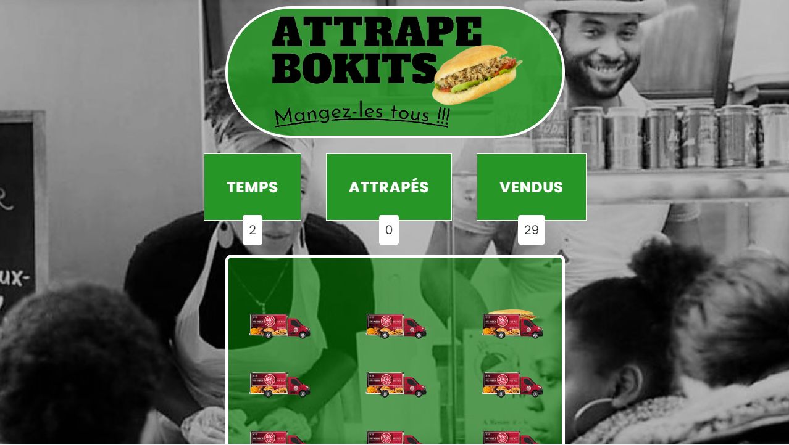

  

<h4 align="center">Développeur passionné par la programmation et la conception d'applications. J'évolue actuellement dans l'univers captivant du développement back-end avec PHP et Symfony. </h4>
<h4 align="center">Mon expertise s'étend également vers la création de plugins et thèmes WordPress. </h4>

<!-- TECHS -->

<h2 align="center">Skills</h2>

 

  
 

 

 
 

 

<!-- PROJECTS -->

## A propos

- 💼  [developpeur BackEnd](https://matthcorvo.github.io/portfolio/)

<!-- PROJECTS -->

<h2 align="center">Projects</h2>

	<table>
		<tr>
			<td width="50%">
				<h3 align="center">L'abattoire végétal</h3>
				
  
					
					 
					 
					

						  
				<!--		 -->
					

					
<strong>Symfony - Mongodb - PHPunit - Javascript - API - Git</strong>

          

						Ajout d'un espace de réservation de table dans un restaurant. Les utilisateurs peuvent inviter des amis en fonction de leurs centres d'intérêt. <b> Ce projet est toujours en cours de développement. </b>
					

				

			</td>
			<td width="50%">
				<h3 align="center">Portfolio</h3>
				
  
					
					 
					 
					

						  
							
					

					 
<strong>HTML - CSS - Javascript</strong>

					
Mon portfolio

				

        </tr>
	    <tr>
            <td width="50%">
                <h3 align="center">Code Saver</h3>
                
  
                    
                     
                     
                    

                          
						
                    

                    
<strong>PHP - MySQL - Bootstrap - Javascript - PHPunit</strong>

		    
Permet aux développeurs de sauvegarder et classer leurs extraits de code.

                

            </td>
            <td width="50%">
                <h3 align="center">Attrape Bokits</h3>
                
  
                    
                     
                     
                    

                          
							
                    

                    
<strong>Javascript - CSS - HTML - PHP - MySQL</strong>

		    
les joueurs doivent cliquer sur des bokits en mouvement pour marquer des points. Le jeu utilise JavaScript, PHP et MySQL pour gérer le gameplay et enregistrer les scores.

                
	
            </td>
        </tr>
	</table>

 
 

<!-- SOCIALS -->

<h2 align="center">Contact</h2>

	&nbsp&nbsp&nbsp
&nbsp&nbsp&nbsp

<!-- STATS -->

<h2 align="center">Stats</h2>
<h6 style="color:red">These stats are only for public repos it don't show private stats on projects for previous employers and clients.</h6>

  

  
&nbsp;

  

 

- [LinkedIn]()
- [Email](promatthcorvo@gmail.com)

