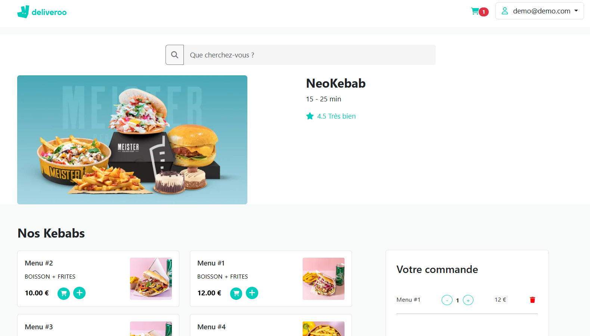
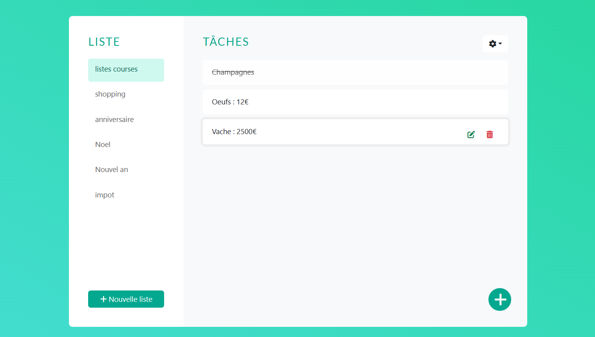

  

<!-- TECHS -->

<h2 align="center">Skills</h2>

 

  

 

 

 

<!-- PROJECTS -->

<h2 align="center">Projects</h2>

	<table>
		<tr>
			<td width="50%">
				<h3 align="center">L'abattoire végétal</h3>
				
  
					
					 
					 
					

						  
		
					

					
<strong>Symfony - Mongodb - Javascript - API - Git</strong>

          

						Ajout d'un espace de réservation de table dans un restaurant. Les utilisateurs peuvent inviter des amis en fonction de leurs centres d'intérêt. 
					

				

			</td>
			<td width="50%">
				<h3 align="center">Job board</h3>
				
  
					
					 
					 
					

						  
							
					

					 
<strong>PHP - RESTful API - MySQL - Bootstrap </strong>

					
Création d'un Job Board, permettant la consultation d'offres d'emploi avec des fonctionnalités de filtrage et de pagination créé avec MySQL et PHP.

				

        </tr>
	    <tr>
            <td width="50%">
                <h3 align="center">Deliveroo clone</h3>
                
  
                    
                     
                     
                    

                          
<!-- 						 -->
                    

                    
<strong>NestJs - PostgreSQL - Bootstrap - Angular </strong>

		    
Creation d’un clone de deliveroo avec NestJS PostgreSQL et  Angular. Ajout au panier et paiement des articles avec authentification

                

            </td>
            <td width="50%">
                <h3 align="center">Gestionnaire de tâches</h3>
                
  
                    
                     
                     
                    

                          
<!-- 							 -->
                    

                    
<strong>Angular - Symfony RESTfulApi - Bootstrap - MySQL</strong>

		    
créer, visualiser, mettre à jour et supprimer des listes de tâches et des tâches individuelles, protégées par l'authentification utilisateur .

                
	
            </td>
        </tr>
	</table>

 
 

<!-- SOCIALS -->

<h2 align="center">Contactez-moi</h2>

	&nbsp&nbsp&nbsp
&nbsp&nbsp&nbsp

